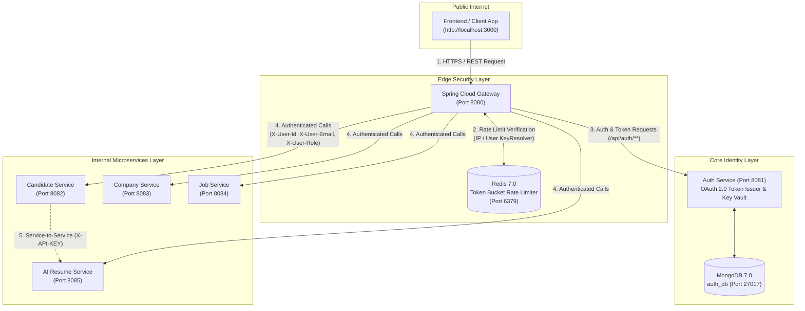
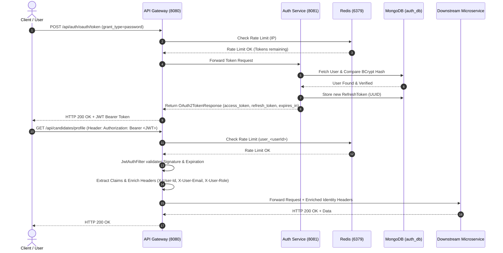

# 🔐 Security Architecture & Implementation Guide — AI Recruitment Platform

This document provides a comprehensive breakdown of the Security Infrastructure, OAuth 2.0 Authorization Flow, JWT Structure, API Key Management, Distributed Rate Limiting, and Database Integration for the **AI Recruitment Platform**.

---

## 1. System Architecture & Security Model Overview

The platform uses an **Enterprise Microservices Architecture** consisting of an **API Gateway (Port 8080)** acting as the single secure entry point and **Auth Service (Port 8081)** acting as the central Identity and Token Issuing Authority.



---

## 2. OAuth 2.0 Authorization Flow (RFC 6749 & RFC 6750)

The platform provides standard OAuth 2.0 protocol compliance at `POST /api/auth/oauth/token` alongside backward-compatible REST endpoints (`/api/auth/login` and `/api/auth/register`).

### Why Stateless JWT Token Issuance with JJWT was Chosen:
- **Stateless & Highly Scalable**: Avoids server-side session affinity or distributed session synchronization across multi-instance microservices.
- **Zero-Latency Gateway Validation**: The API Gateway verifies cryptographic signatures locally using HMAC-SHA256 without needing a synchronous blocking HTTP lookup for every inbound request.
- **Standards Compliant**: Emits RFC 6749/6750 compliant bearer tokens with standard claims and error envelopes.

### Detailed End-to-End Sequence:



### Supported OAuth 2.0 Grant Types:

| Grant Type | Endpoint | Payload Parameters | Use Case |
|---|---|---|---|
| `password` | `POST /api/auth/oauth/token` | `grant_type=password`, `username`, `password`, `scope` | User interactive login from SPA frontend |
| `refresh_token` | `POST /api/auth/oauth/token` | `grant_type=refresh_token`, `refresh_token` | Silent token renewal when access token expires |
| `client_credentials` | `POST /api/auth/oauth/token` | `grant_type=client_credentials`, `client_id`, `client_secret` | Machine-to-machine / Cron / Batch service authorization |

---

## 3. JWT Token Structure & Claims Specification

- **Algorithm**: `HS256` (HMAC using SHA-256 with 256-bit secret)
- **Token Format**: Standard compact serialization (`<Header>.<Payload>.<Signature>`)

### Token Payload Example:
```json
{
  "sub": "candidate@example.com",
  "userId": "66c3abc1234567890abcdef1",
  "email": "candidate@example.com",
  "role": "ROLE_CANDIDATE",
  "iat": 1755620000,
  "exp": 1755706400
}
```

### Identity Header Injection:
Once verified by the Gateway, downstream services receive sanitized and trusted user context:
- `X-User-Id`: MongoDB ObjectId of the authenticated user (e.g. `66c3abc1234567890abcdef1`)
- `X-User-Email`: User's verified email address (e.g. `candidate@example.com`)
- `X-User-Role`: Assigned RBAC role (`ROLE_CANDIDATE`, `ROLE_COMPANY`, `ROLE_ADMIN`)

---

## 4. Distributed Rate Limiting (Redis Token Bucket)

The API Gateway enforces rate limiting using Spring Cloud Gateway's built-in **Redis-backed Token Bucket Filter** (`RequestRateLimiter`):

- **Algorithm**: Token Bucket (Continuous replenishment)
- **Replenish Rate**: `20` tokens/second (~1,200 requests/minute per client)
- **Burst Capacity**: `40` tokens (allows sudden traffic bursts up to 40 reqs)
- **Key Resolvers**:
  - `userKeyResolver`: Uses authenticated JWT `user_<userId>`.
  - `ipKeyResolver`: Extracts client remote address / `X-Forwarded-For` header `ip_<ipAddress>`.

### HTTP 429 Too Many Requests Response Body:
```json
{
  "success": false,
  "message": "Too Many Requests - Rate limit exceeded. Please try again later.",
  "data": null,
  "timestamp": "2026-08-19T22:50:00Z"
}
```

---

## 5. Service-to-Service API Key Management

For asynchronous or synchronous inter-service communication (e.g. `CandidateService` -> `AIResumeService`):

1. **Header Requirement**: `X-API-KEY: sec_<servicename>_<token>`
2. **Generation**: `POST /api/auth/api-keys` creates cryptographically secure, random 256-bit API keys stored in MongoDB `api_keys` collection.
3. **Gateway Bypass**: When an internal API Key is verified, the Gateway injects `X-Service-Auth: INTERNAL_SERVICE`.

---

## 6. CORS Policy & Zero-Information-Leak Error Shielding

### CORS Settings (`CorsConfig.java`):
- **Allowed Origins**: `http://localhost:3000`, `http://127.0.0.1:3000`, `http://localhost:5173`, `http://127.0.0.1:5173`
- **Allowed Methods**: `GET, POST, PUT, DELETE, OPTIONS, PATCH, HEAD`
- **Allowed Headers**: `*`
- **Exposed Headers**: `Authorization, X-User-Id, X-User-Email, X-User-Role, X-API-KEY, Retry-After`
- **Allow Credentials**: `true`
- **Max Age**: `3600` seconds

### Error Shielding (`GatewayExceptionHandler.java`):
- Strips internal microservice hostnames, IP addresses, and Java stack traces.
- Translates connection failures to `503 Service Unavailable`.
- Returns uniform `{ success: false, message: "...", data: null, timestamp: "..." }` responses.

---

## 7. MongoDB 7.0 Connection String Reference for Team Members

All services follow the **Database-per-Service** pattern with MongoDB 7:

| Service Name | Member | Container Name | Host Port | Internal Port | Database Name | Standard `SPRING_DATA_MONGODB_URI` |
|---|---|---|---|---|---|---|
| **Auth Service** | Member 1 | `auth-db` | `27017` | `27017` | `auth_db` | `mongodb://auth-db:27017/auth_db` |
| **Candidate Service** | Member 2 | `candidate-db` | `27018` | `27017` | `candidate_db` | `mongodb://candidate-db:27017/candidate_db` |
| **Company Service** | Member 3 | `company-db` | `27019` | `27017` | `company_db` | `mongodb://company-db:27017/company_db` |
| **Job Service** | Member 4 | `job-db` | `27020` | `27017` | `job_db` | `mongodb://job-db:27017/job_db` |
| **AI Resume Service** | Member 5 | `ai-db` | `27021` | `27017` | `ai_db` | `mongodb://ai-db:27017/ai_db` |

### Local Development (without Docker Compose):
For running individual services on localhost, configure your `application.yml` with:
```yaml
spring:
  data:
    mongodb:
      uri: mongodb://localhost:27017/<your_service_db>
```
